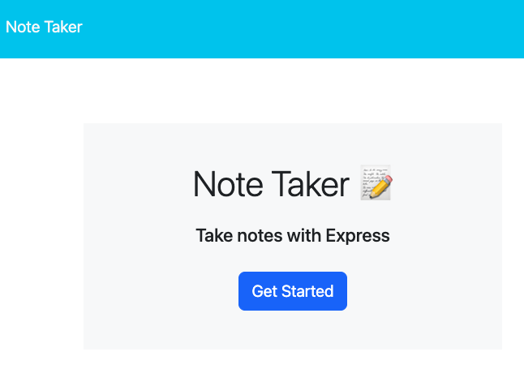
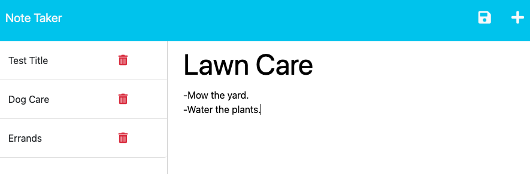

# Note Taker Applicaton with Express.js
An application used to take and store notes using Express.js.

## Description

This note-taking program is a simple and user-friendly tool designed to help users take and organize notes efficiently. It provides a seamless note-taking experience with an intuitive interface, allowing users to write, save, and delete notes. This application is hosted via Heroku and built using Express.js. For each note taken, they are given a unique identifier using the Uniqid package.

[GitHub Repository](https://github.com/chadkraus87/NoteTaker)

## Table of Contents

- [Installation](#installation)
- [Usage](#usage)
- [License](#license)
- [Contributing](#contributing)
- [Tests](#tests)
- [Questions](#questions)

## Installation

The Express package is required to run this application. To install the package, please visit [NPM Express documentation](https://www.npmjs.com/package/express)

The Uniqid package is required to run this application. To install the package, please visit [NPM Uniqid documentation](https://www.npmjs.com/package/uniqid).

The Nodemon package is an optional package install, but will assist with testing. To install the package, please visit [Nodemon documentation](https://www.npmjs.com/package/nodemon).

## Usage

The Note Taker application is designed to meet the needs of small business owners, enabling them to easily write and save notes. With a user-friendly interface, the application presents a landing page with a link to the notes page, where existing notes are listed in the left-hand column and empty fields are provided in the right-hand column to enter new note titles and text. By clicking the Save icon, newly entered notes are saved and appear in the left-hand column, and clicking on existing notes displays them in the right-hand column. The Write icon allows users to quickly enter new notes. Streamline your note-taking and task organization with the Note Taker application today!

## License

This project is licensed under the MIT License.

## Contributing

[Uniqid](https://www.npmjs.com/package/uniqid)

[Nodemon](https://www.npmjs.com/package/nodemon)

[Express.js Routing](https://expressjs.com/en/guide/routing.html)

[Getting Started - Heroku](https://devcenter.heroku.com/articles/heroku-cli)

[Getting Started on Heroku with Node.js](https://devcenter.heroku.com/articles/getting-started-with-nodejs#deploy-the-app)

[Writing Middleware](https://expressjs.com/en/guide/writing-middleware.html)

## Tests

N/A

## Questions

If you have any questions or comments about this project, please contact me at chadkraus87@gmail.com. You can also find more information and other projects on my GitHub https://github.com/chadkraus87. If you encounter any issues or bugs while using this tool, please report them to the project GitHub repository so that they can be addressed. Additionally, contributions to this project are always welcome. If you would like to contribute, please review the project contribution guidelines and submit a pull request. Thank you for your support!